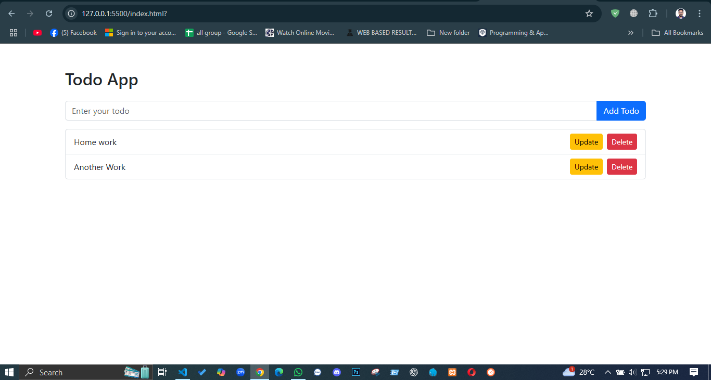

# ✅ Todo App (Module 11 Project)

A simple and clean Todo App built using **HTML**, **Bootstrap CSS**, and **Vanilla JavaScript**.  
This app allows users to **add**, **delete**, **update**, and **display todos** dynamically.

---

## 📸 Preview



---

## 🚀 Features

- 📝 Add new todos
- ❌ Delete existing todos
- 🔄 Inline update of todos using "Update" button
- 📋 All todos dynamically rendered in a list

---

## 💻 Technologies Used

- HTML5
- Bootstrap 5 (via CDN)
- JavaScript (Vanilla)

---

## 📁 Project Structure

```plaintext
/todo-app/
├── index.html     # Provided HTML template
├── script.js      # JavaScript logic
└── README.md      # Project documentation
```

## 🧠 How Update Feature Works

- Each todo has an **Update** button.
- Clicking the button turns the todo text into an input field.
- Pressing **Enter** or clicking outside the input saves the updated text.
- No `prompt()` used — editing happens **inline** inside the list.

---

## 📦 How to Use

1. Clone or download this repository.
2. Open `index.html` in your browser.
3. Add, delete, or update todos using the interface.

---

## ⚠️ Submission Checklist

- ✅ Used the provided `index.html` template without changing structure
- ✅ `script.js` written manually (vanilla JS)
- ✅ Update functionality added with an Update button (as instructed)
- ✅ No extra features or libraries used
- ✅ Includes a screenshot placeholder

---

## 👨‍💻 Author

**Md. Foisal**  
_Module 11 Project | Ostad PHP|Laravel|JS|Vue.js Web Development Course_
